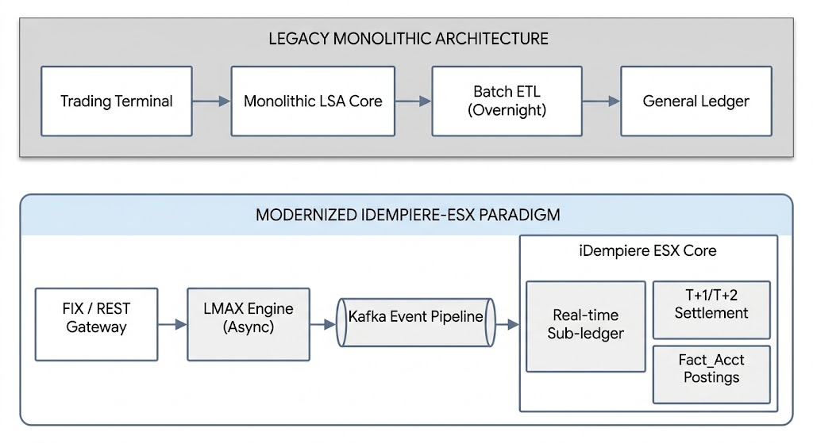

# Executive Summary & Architecture Overview

## 1. Modernizing Legacy Financial Infrastructure

### 1.1 The Business Case: Transitioning from Legacy Systems (LSA, Proprietary Cores) to Open-Source ERP

Legacy Stock Exchange and Securities Trading cores—such as LSA (Local Stock Exchange Application) and mainframe-era settlement systems—face acute operational bottlenecks:

1. **Monolithic Lock-in & Vendor Tax**: High license fees and proprietary database locks limit horizontal scaling and feature velocity.
2. **Brittle Sub-Ledger Integration**: Traditional cores execute trades but rely on batch ETL jobs to update back-office accounting, introducing multi-hour delays in position reporting, regulatory reporting, and risk management.
3. **Inflexible Instrument Lifecycle**: Modifying parameters for new asset classes (e.g., tokenized treasuries, corporate bonds, fractional equities) requires vendor-level code refactoring.

The `idempiere-esx` architecture replaces monolithic trading backbones by adapting **iDempiere ERP** as an extensible, double-entry clearing ledger, depository, and general accounting core. By decoupling order matching from settlement posting, `idempiere-esx` achieves enterprise-grade financial integrity without sacrificing sub-millisecond execution speeds.



### 1.2 Core Architectural Paradigm: Separation of the High-Throughput Matching Layer from the Financial Settlement Ledger

Standard ERP database engines are optimized for ACID compliance, multi-table JOIN operations, and transactional auditing—not sub-millisecond Continuous Limit Order Book (CLOB) execution. Conversely, matching engines excel at high-speed array operations in memory but lack comprehensive multi-currency, double-entry general ledger mechanics.

`idempiere-esx` implements an **Asynchronous CQRS / Event-Driven Paradigm**:

* **Command Path (Execution)**: Orders are processed in memory via an LMAX Disruptor ring buffer engine. Memory-bound validations execute within microseconds.
* **Query & Ledger Path (Settlement & Reporting)**: Execution events write asynchronously into iDempiere's `T_Order` and `T_ExecutionReport` tables, triggering double-entry transaction generation (`Fact_Acct`) and updating depository custody sub-ledgers (`T_Security_Balance`).

assets/images/Summary/1-2-CQRS-separation-pattern.png)

### 1.3 System Non-Functional Requirements (NFRs)

| NFR Metric | Target Parameter | Implementation Mechanism |
| :--- | :--- | :--- |
| **Order Ingestion Latency** | $< 10\text{ ms}$ ($p99$) | Low-overhead gRPC / FIX 4.4 Gateway bypassing web UI layers |
| **Order Matching Latency** | $< 500\ \mu\text{s}$ | In-memory LMAX Disruptor Ring Buffer matching engine |
| **Settlement Throughput** | $> 5,000\text{ TPS}$ | Citus-sharded PostgreSQL tables (`T_Order`, `T_TradeMatch`) |
| **Settlement Integrity** | $100\%$ Double-Entry Balance | Synchronous Model Validation + Asynchronous `Fact_Acct` GL posting |
| **Audit Compliance** | SEC Rule 17a-4 / FINRA | Immutable `AD_ChangeLog` + Microsecond Write-Ahead Logging (WAL) |
| **High Availability** | $99.999\%$ Uptime | 2-Node Proxmox VE Cluster + Percona PostgreSQL Operator + Patroni |

---

## 2. Enterprise Topography & System Boundaries

### 2.1 Component Interaction Topology

The `idempiere-esx` platform comprises five key runtime zones:

1. **Ingestion & Protocol Layer**: FIX 4.4 engine (QuickFIX/J) and gRPC services for algorithmic trading pipelines.
2. **In-Memory Execution Engine**: Standalone Java daemon implementing LMAX Disruptor ring buffers and continuous order book state.
3. **Event Broker Layer**: Apache Kafka cluster managing execution streaming topics (`orders.ingested`, `trades.executed`, `settlements.pending`).
4. **iDempiere Core Platform**: Extended OSGi environment handling user state, BPartner accounts, fee mechanics, and compliance reporting.
5. **Persistence Layer**: Citus-sharded PostgreSQL running on Red Hat OpenShift / RHEL 10 with SEPostgreSQL MAC isolation.

```
+-----------------------------------------------------------------------------------+
|                         IDEMPIERE-ESX RUNTIME TOPOLOGY                            |
|                                                                                   |
|  [ Institutional FIX ]    [ Web / Mobile REST ]     [ Algo Trading gRPC ]         |
|             |                       |                         |                   |
|             v                       v                         v                   |
|  +-----------------------------------------------------------------------------+  |
|  |                      INGESTION & PROTOCOL GATEWAY                           |  |
|  +-----------------------------------------------------------------------------+  |
|                                     |                                             |
|                                     v                                             |
|  +-----------------------------------------------------------------------------+  |
|  |                 IN-MEMORY MATCHING ENGINE (LMAX DISRUPTOR)                  |  |
|  +-----------------------------------------------------------------------------+  |
|                                     |                                             |
|                          (Execution Event Payload)                                |
|                                     v                                             |
|  +-----------------------------------------------------------------------------+  |
|  |                     APACHE KAFKA DISTRIBUTED EVENT BUS                      |  |
|  +-----------------------------------------------------------------------------+  |
|                                     |                                             |
|                                     v                                             |
|  +-----------------------------------------------------------------------------+  |
|  |                     IDEMPIERE ESX OSGI PLUGIN ENGINE                        |  |
|  |  - Pre-Trade Risk Validator    - Depository Holdings Sub-ledger             |  |
|  |  - Doc_TradeOrder Engine       - Fact_Acct Accounting Engine               |  |
|  +-----------------------------------------------------------------------------+  |
|                                     |                                             |
|                                     v                                             |
|  +-----------------------------------------------------------------------------+  |
|  |               CITUS DISTRIBUTED POSTGRESQL (OPENSHIFT / RHEL 10)            |  |
|  +-----------------------------------------------------------------------------+  |
+-----------------------------------------------------------------------------------+
```

#### DALL-E 3 Image Generation Prompt
> *A top-down enterprise software topology schematic in clean light mode. Three client boxes at top: 'Institutional FIX', 'Web / Mobile REST', 'Algo Trading gRPC'. All point down to a rectangular block 'INGESTION & PROTOCOL GATEWAY'. Data flows down through 'IN-MEMORY MATCHING ENGINE (LMAX DISRUPTOR)', then to 'APACHE KAFKA DISTRIBUTED EVENT BUS', then to 'IDEMPIERE ESX OSGI PLUGIN ENGINE' (containing sub-bullets: 'Pre-Trade Risk Validator', 'Depository Holdings Sub-ledger', 'Doc_TradeOrder Engine', 'Fact_Acct Accounting Engine'), and finally into 'CITUS DISTRIBUTED POSTGRESQL (OPENSHIFT / RHEL 10)'. Blueprint print style, minimal shadows, white background, charcoal and teal color coding. Text in Google Sans Flex 12Pt style, table/code references in Google Sans Code 12Pt style. Do not display any font names in the image.*

---

### 2.2 Event-Driven Messaging Layer (Kafka Integration Pattern)

When an order arrives, `idempiere-esx` executes a two-phase async dispatch strategy:

```sql
-- Conceptual Execution Flow in Kafka Topic Routing:
-- Topic 1: esx.orders.raw        -> Ingestion Gateway to Matching Engine
-- Topic 2: esx.trades.executed   -> Matching Engine to iDempiere Ingestion Worker
-- Topic 3: esx.clearing.posted   -> iDempiere Engine to General Ledger & Reporting
```

1. **Ingestion Validation**: The REST/FIX Gateway queries iDempiere's `T_Security_Balance` in-memory Redis cache to confirm available shares or cash.
2. **Pledge Reservation**: Cash/shares are synchronously moved from `FreeBalance` to `PledgedBalance`.
3. **Engine Dispatch**: A lightweight event payload is published to `esx.orders.raw`.
4. **Match Notification**: On match execution, the engine emits an event to `esx.trades.executed`.
5. **Ledger Completion**: The iDempiere asynchronous listener consumes the execution event, executes multi-leg settlement logic (`Doc_TradeOrder`), and transfers pledged assets to final ownership balances.

---

### 2.3 Ledger Partitioning Strategy: Real-Time Pledged Balances vs. Asynchronous General Ledger Posting

To guarantee sub-second trade turnaround while preserving strict accounting controls, `idempiere-esx` partitions asset state into two operational ledgers:

```
+-----------------------------------------------------------------------------------+
|                        LEDGER PARTITIONING ARCHITECTURE                           |
|                                                                                   |
|  Operational Depository Sub-ledger              General Ledger (Fact_Acct)        |
|  (T_Security_Balance & C_BP_BankAccount)        (Double-Entry Financial Accounting) |
|  +-------------------------------------+        +-------------------------------+ |
|  | Real-Time In-Memory / Database        |        | Asynchronous Batch / Event    | |
|  | - Lock Free Balance                 |        | - Multi-leg Journal Entries   | |
|  | - Update Pledged Balance            | ---->  | - Debit / Credit Ledger Lines | |
|  | - Immediate Order Placement         |        | - Fee & Tax Recognitions      | |
|  | - Microsecond Precision             |        | - End-of-Day Balancing        | |
|  +-------------------------------------+        +-------------------------------+ |
+-----------------------------------------------------------------------------------+
```

#### DALL-E 3 Image Generation Prompt
> *A clean light-mode print illustration showing a side-by-side ledger partitioning comparison. Left box titled 'Operational Depository Sub-ledger (T_Security_Balance & C_BP_BankAccount)' lists: 'Real-Time In-Memory / Database', 'Lock Free Balance', 'Update Pledged Balance', 'Immediate Order Placement', 'Microsecond Precision'. An arrow points from the left box to the right box titled 'General Ledger (Fact_Acct) (Double-Entry Financial Accounting)', which lists: 'Asynchronous Batch / Event', 'Multi-leg Journal Entries', 'Debit / Credit Ledger Lines', 'Fee & Tax Recognitions', 'End-of-Day Balancing'. Crisp lines, white background, light gray shading for contrast. Standard text formatted in Google Sans Flex 12Pt style, database table names formatted in Google Sans Code 12Pt style. Do not display any font names in the image.*

#### State Management Matrix

| Order State | Operational Sub-ledger (`T_Security_Balance`) | General Ledger State (`Fact_Acct`) |
| :--- | :--- | :--- |
| **New Order** | `FreeBalance` decremented; `PledgedBalance` incremented | Unposted (No accounting event generated) |
| **Executed Trade ($T$)** | Pledged funds transferred to escrow account | Trade Date Clearing Entry Posted ($T$ Cash Reserve) |
| **Settlement ($T+1/T+2$)** | Pledged shares delivered to Purchaser `FreeBalance` | Final Custody Transfer + Fee/Tax Posting |
| **Cancelled Order** | `PledgedBalance` released back to `FreeBalance` | Unposted (No financial impact) |
